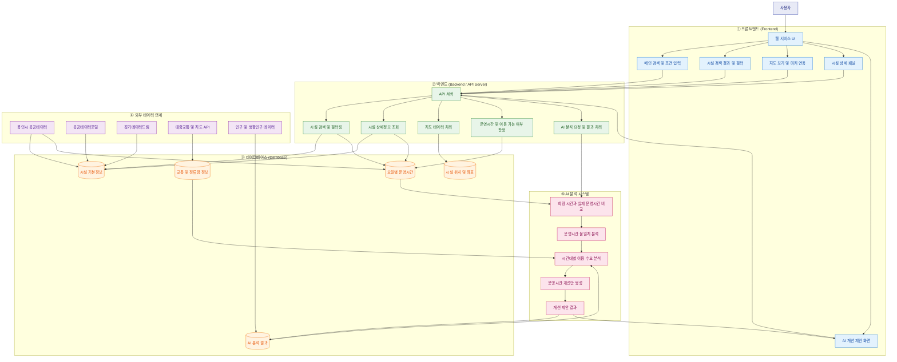

# 시스템 아키텍처 설계서

```mermaid
flowchart TB
    USER["사용자"]

    subgraph FE["① 프론트엔드 (Frontend)"]
        direction TB
        UI["웹 서비스 UI"]
        SEARCH["메인 검색 및 조건 입력"]
        RESULT["시설 검색 결과 및 필터"]
        MAP["지도 보기 및 마커 연동"]
        DETAIL["시설 상세 패널"]
        AI_VIEW["AI 개선 제안 화면"]

        UI --> SEARCH
        UI --> RESULT
        UI --> MAP
        UI --> DETAIL
        UI --> AI_VIEW
    end

    subgraph BE["② 백엔드 (Backend / API Server)"]
        direction TB
        API["API 서버"]
        SEARCH_API["시설 검색 및 필터링"]
        FACILITY_API["시설 상세정보 조회"]
        MAP_API["지도 데이터 처리"]
        TIME_API["운영시간 및 이용 가능 여부 판정"]
        AI_API["AI 분석 요청 및 결과 처리"]

        API --> SEARCH_API
        API --> FACILITY_API
        API --> MAP_API
        API --> TIME_API
        API --> AI_API
    end

    subgraph DB["③ 데이터베이스 (Database)"]
        direction TB
        FACILITY_DB[("시설 기본정보")]
        HOURS_DB[("요일별 운영시간")]
        LOCATION_DB[("시설 위치 및 좌표")]
        TRANSPORT_DB[("교통 및 정류장 정보")]
        ANALYSIS_DB[("AI 분석 결과")]
    end

    subgraph EXT["④ 외부 데이터 연계"]
        direction TB
        PUBLIC["용인시 공공데이터"]
        PORTAL["공공데이터포털"]
        GYEONGGI["경기데이터드림"]
        TRANSPORT["대중교통 및 지도 API"]
        POPULATION["인구 및 생활인구 데이터"]
    end

    subgraph AI["⑤ AI 분석 시스템"]
        direction TB
        COMPARE["희망 시간과 실제 운영시간 비교"]
        GAP["운영시간 불일치 분석"]
        DEMAND["시간대별 이용 수요 분석"]
        RECOMMEND["운영시간 개선안 생성"]
        OUTPUT["개선 제안 결과"]

        COMPARE --> GAP
        GAP --> DEMAND
        DEMAND --> RECOMMEND
        RECOMMEND --> OUTPUT
    end

    USER --> UI
    SEARCH --> API
    RESULT --> API
    MAP --> API
    DETAIL --> API
    AI_VIEW --> API

    SEARCH_API --> FACILITY_DB
    SEARCH_API --> HOURS_DB
    FACILITY_API --> FACILITY_DB
    FACILITY_API --> HOURS_DB
    MAP_API --> LOCATION_DB
    TIME_API --> HOURS_DB

    PUBLIC --> FACILITY_DB
    PUBLIC --> HOURS_DB
    PORTAL --> FACILITY_DB
    GYEONGGI --> FACILITY_DB
    TRANSPORT --> TRANSPORT_DB
    POPULATION --> ANALYSIS_DB

    AI_API --> COMPARE
    HOURS_DB --> COMPARE
    ANALYSIS_DB --> DEMAND
    TRANSPORT_DB --> DEMAND
    OUTPUT --> ANALYSIS_DB
    OUTPUT --> AI_VIEW

    classDef user fill:#E8EAF6,stroke:#3949AB,color:#1A237E
    classDef frontend fill:#E3F2FD,stroke:#1976D2,color:#0D47A1
    classDef backend fill:#E8F5E9,stroke:#388E3C,color:#1B5E20
    classDef database fill:#FFF3E0,stroke:#EF6C00,color:#E65100
    classDef external fill:#F3E5F5,stroke:#8E24AA,color:#4A148C
    classDef ai fill:#FCE4EC,stroke:#C2185B,color:#880E4F

    class USER user
    class UI,SEARCH,RESULT,MAP,DETAIL,AI_VIEW frontend
    class API,SEARCH_API,FACILITY_API,MAP_API,TIME_API,AI_API backend
    class FACILITY_DB,HOURS_DB,LOCATION_DB,TRANSPORT_DB,ANALYSIS_DB database
    class PUBLIC,PORTAL,GYEONGGI,TRANSPORT,POPULATION external
    class COMPARE,GAP,DEMAND,RECOMMEND,OUTPUT ai
```
